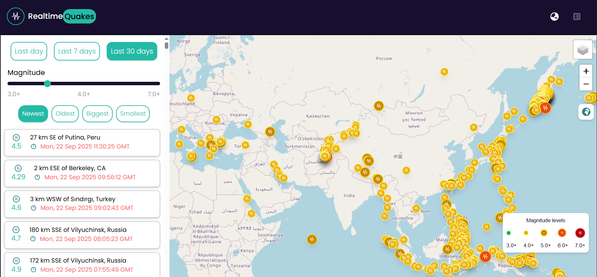

# Realtime Quake

An app to check realtime earthquakes that are happening all over the world!

### Pre-requirements

- Node.js (v20 ou superior)
- npm / yarn / pnpm

### How to install

```bash
# Clone the repo
git clone https://github.com/Fabio-FG/earthquake-system.git

# Install dependencies
npm install

# Config the .env file (check the .env.example)
cp .env.example .env

#run the project
npm run dev

```

## Screenshots

Realtime Quake App


<details>
<summary>More screenshots</summary>


</details>

## Features

- Earthquake listing: Check the latest registred earthquakes all over the world
- Earthquake sort: Sort the earthquake data by period of time.
- Earthquake order: Order the earthquake data by magnitude / by oldest or most recent earthquake.
- Earthquake Magnitude Scale: Check the illustrated magnitude scale.
- Map layers: Choose different map layers.
- Map regions: Focus on specific regions.


## Tech stack

### Frontend
- **React**
- **TypeScript**
- **Vite**

### Styling
- **Tailwind CSS** 
- **React-icons**

### Libraries
- **Tanstack Query** 
- **Tanstack Router** 
- **Zustand**
- **Zod**
- **Axios**
- **Leaflet** / **Leaflet-React**

### Deployment
- **Cloudflare pages**


## Demo

🔗 **[Demo](https://earthquake-system.pages.dev/)**


## Design Decisions
- Used a restricted color palette that I thought would look clean, modern and minimalist.
- Responsive first.

**color palette**
- **main colour**:  `#160f2e`
- **main text colour**:  `#00bba7`


## Challenges
- Handling big data sets;
- Component renderization hierarchy;
- Map constraints (zoom causing header to disappear, out of bounds handling)

## Limitations
- Using Leaflet.js does not allow for 3D rendering. Mapbox would be fitting for this but due to time constraint I opted to use Leaflet.
- Pagination constraints would conflict between the List component and the Map component. Therefore, this feature was put on the Backlog for future improvements.


## Backlog (Future Improvements)
- [ ] Add unit tests (e.g: Jest)
- [ ] Add Components such as Pagination to the Earthquake list and Drawer to improve UX when selecting a Marker.
- [ ] Refactor the renderization hierarchy


### Documentation and sources

- https://www.usgs.gov/programs/earthquake-hazards/earthquakes
- https://earthquake.usgs.gov/fdsnws/event/1/
- https://flowbite.com/docs/getting-started/introduction/
- https://www.mapping101.com/skills/leaflet-zoompan
- https://tailwindcss.com/
- https://openmaptiles.org/styles/

